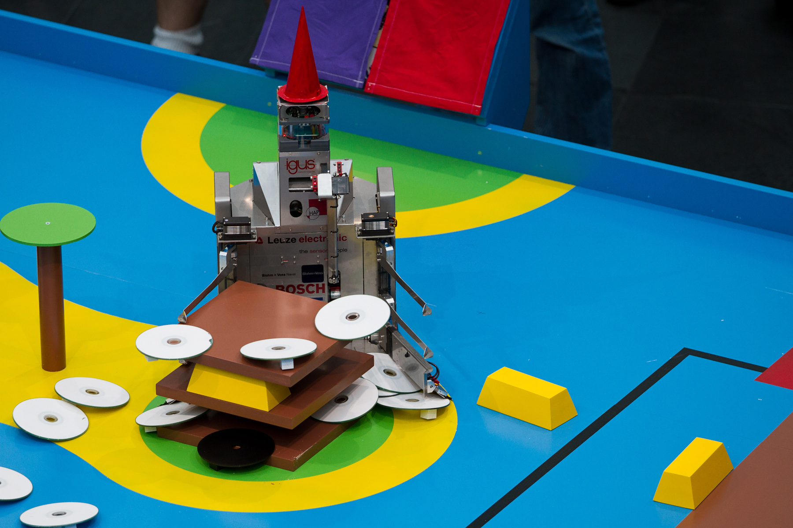
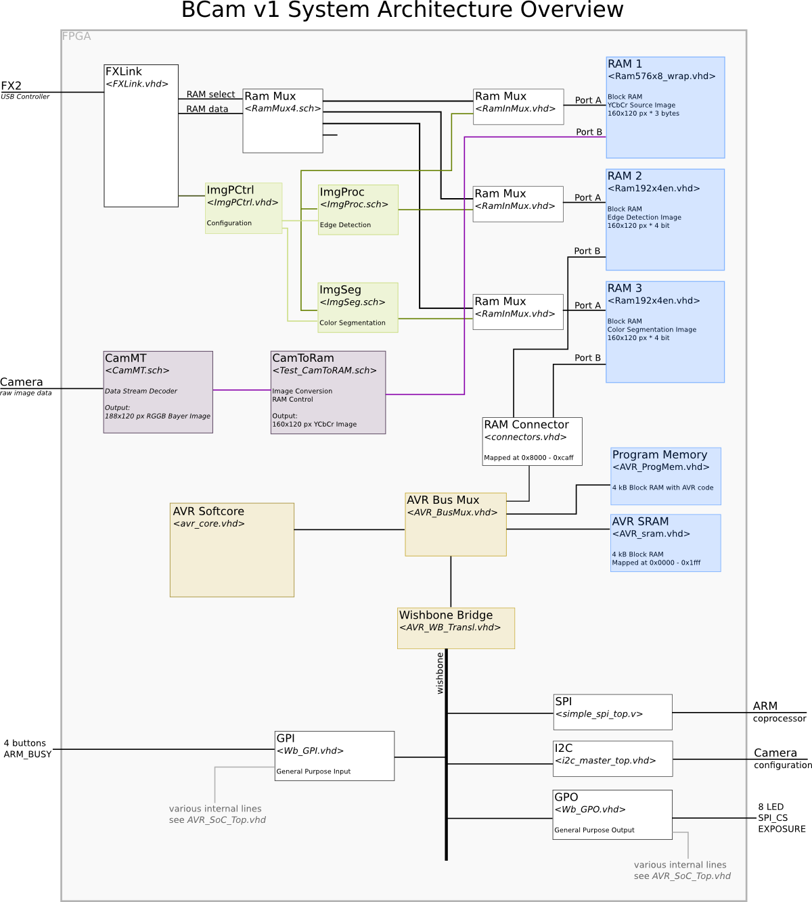

# FPGA-Kamerasystem

## Kontext

Das FPGA-Kamerasystem wurde für den [TURAG-Roboter Brain](https://turag.de/fotos-vom-deutschen-vorausscheid-in-muenchen/) entwickelt, dessen Aufgabe beim [Eurobot 2012](https://turag.de/category/eurobot-2012/) es u. a. war, Spielelemente (Münzen) auf einer Schatzinsel einzusammeln und auf das Deck des eigenes Schiffes zu bringen.

Das Kamerasystem sollte Spielelemente erkennen und deren Positionen an die Spielsteuerung schicken.



Der Kern des Ganzen ist ein FPGA, der die aufwändige Bildverarbeitung und Objekterkennung durchführt und die aufbereiteten Daten an den Mikrocontroller schickt.
Dieser kann weitere Schritte mit den Daten durchführen und schickt schließlich die Positionen der Objekte per CAN-Bus an die System Control im Roboter. Dort können die Positionen der Spielelemente in Strategieentscheidungen einfließen.

### Release Notes 2021

* Das vorliegende Projekt wird wahrscheinlich niemand 1:1 nachbauen wollen, da es sehr auf unseren Einsatzzweck zugeschnitten ist.
* Jedoch dürften die eigenen VHDL/Verilog-Module noch für anderweitige Nutzung interessant sein und die Architektur ist auch recht interessant.
* Daher wird hier der selbst entwickelte Code veröffentlicht (unter GPLv3), sowie jener benutzte fremde Code, der eine Republizierung zulässt mit unseren Modifikationen unter ihrer ursprünglichen Lizenz.
* Leider mussten ein paar Module vor der Veröffentlichung entfernt werden, da sie zwar *open source* sind (die Quellen sind verlinkt), aber keine *freie Software*, die eine Weiterverteilung unsererseits zulässt. Es handelt sich jedoch um nichts für die Wiederverwendung wichtiges (hauptsächlich Ansteuerung von Peripherie).
* Sorry that this documentation is completely in German. It started this way in our internal wiki and we kept going.

#### v1 und v2

*BCam v1* ist der während des Eurobot 2012 entwickelte Code zur Spielelementerkennung, der unter Laborbedingungen funktioniert hat. Gänzlich ausgefeilt wurde er nicht, da Brain andere Baustellen hatte, die dringender waren und um die wir uns priorisiert kümmern mussten.

Interessant wären hier die einzelnen VHDL-Module, die sich wiederverwenden ließen.

*BCam v2* ist ein Rewrite unter Berücksichtigungen einiger Lehren, die wir aus v1 gezogen haben. Weiterhin sind wir von VHDL und Schematics zu reinem Verilog umgestiegen.

Diese Version könnte als Ganzes ein Startpunkt für ein Projekt oder Weiterentwicklung sein.

## BCam v1

### Übersicht



* Über FXLink kann man vom PC aus per USB die RAMs 1 bis 3 auslesen und somit das Originalbild und die Ergebnisbilder sehen. Weiterhin lassen sich ein paar simple Einstellungen vornehmen (nicht gezeigt).
* Der AVR steuert den zeitlichen Ablauf von Bildaufnahme, -verarbeitung und Verschicken der Ergebnisse. Außerdem kümmert er sich um einige andere Sachen (siehe `AVR-firmware/cdetect`).
* Die Kamera wird vom AVR per I2C konfiguriert.
* Die Kamera liefert nun permanent Bilddaten mit 60 fps in 752x480 px und Farbe.
* Ist alles bereit, wird auf den nächsten Frame-Beginn gewartet (dies macht CamMT), dessen Bilddaten werden umgewandelt (CamToRam) und in RAM 1 geschrieben.
* Dann lesen ImgProc und ImgSeg diese Daten aus RAM 1 wieder aus, führen ihre Bilderkennung durch und schreiben ihre Ergebnisse in RAM 2 und 3.
* Der AVR wartet, bis der ARM für neue Daten bereit ist, liest die Daten aus RAM 2 und 3 und schickt diese per SPI an den ARM.
* Auf dem ARM wird das Kanten- und gefilterte Farbbild ausgewertet (Code in `fpga_can_bridge`), die Objekte erkannt und die Positionen über den CAN-Bus an die SystemControl geschickt (letzteres noch nicht implementiert).

## BCam v2

Hier steht der Wishbone-Bus im Mittelpunkt, über den alle Module konfiguriert und gesteuert werden. Dies soll für eine klarere Struktur als in v1 sorgen.
Alle Daten laufen hier entlang, mit Ausnahme der Datenpfade mit besonders hoher Bandbreite, wie Kamerabild und Bildverarbeitung, die eigene Verbindungen bekommen (evtl. mittels FML-Bus).
*Milkymist* ist hier ein gutes Vorbild mit viel Dokumentation.

Vom PC aus lassen sich über FXLink(`_wb`) alle Module auch manuell ansteuern, was das Debugging im Vergleich zu v1 sehr erleichtern wird.
Die Steuerung übernimmt nun ein [lm32](http://www.das-labor.org/wiki/Soc-lm32) (den auch Milkymist benutzt). Dieser benutzt von Haus aus Wishbone mit 32 Bit Adress-/Datenbreite als Instruktions- und Datenbus -- im Gegensatz zum stark erweiterten AVR in v1, bei dem durch die Bridge und die 8 Bit Busbreite die Performance auf dem Wishbone-Bus sehr litt.

Die begrenzte Menge Block RAM war in v1 ein großes Problem und führte zu einigen Kompromissen. Hier soll Block RAM nur noch für die Caches und den Bootloader des lm32 benutzt werden, sowie einige benötigte FIFOs und andere Buffer. Auf jeden Fall nicht als zentraler Bild- und Programmspeicher. Als Datenhalde sollen die 64 MB DDR-RAM herhalten.

Der lm32-Bootloader soll beim Start den eigentlichen Programmcode von der SD-Karte in RAM2 laden. Alternativ lässt sich für die Entwicklung RAM2 auch vom PC aus direkt mit Code beschreiben.

Weitere Dokumentation befindet sich in `./doc/v2*`.

### Wishbone Bus
  
```text
  Masters:
    |-> FXLink      (USB -> PC)
    |-> lm32 ibus   (Softcore CPU)
    |-> lm32 dbus
    |-> SDCARD DMA  (SD controller DMA master)
  Slaves:
    |-> RAM1        (Block RAM, few kB, lm32 Bootloader)
    |-> RAM2        (DDR RAM, 64 MB, lm32 System + working area)
    |-> CAN         (Robot Backplane CAN Bus)
    |-> SPI         (AT91SAM7 coprocessor)
    |-> I2C         (Camera control)
    |-> GPIO        (8 LED, 4 switches, 2 coprocessor signals, PWM: LED headlights)
    |-> VGA         (VGA image output)
    |-> SDCARD      (SD controller configuration)
    |-> MTCam       (Camera data grabber configuration)
    |-> ImgProc     (Image Processor configuration)
```

### Hardware

Wir benutzen ein fertiges FPGA-Modul, das wir auf unsere Platine mit dem ARM raufstecken.

FPGA-Board: ZTEX USB-FPGA-Modul 1.11c ([Doku](http://www.ztex.de/usb-fpga-1/usb-fpga-1.11.e.html))

Auf dem Board:

* Xilinx XC6SLX25
* Cypress FX2
* RAM bis zum Umfallen
* etliche I/Os
* näheres siehe Doku

Dazu kommt dann unsere Platine:

* **MCU:** Atmel AT91SAM7X256 - Kommuniziert über zwei SPIs (oder SSC) mit dem FPGA.
* Steckverbinder zur FPGA-Platine
* Schaltregler für die Spannungen, die das FPGA-Board braucht
* Kamera-Anschluss für Phytec-Kamera und kleine Kamera
* UART zum Debuggen, FT232? (2 Pins)
* große LED mit Helligkeitmodulation für Spielfeldbeleuchtung (2 Pins)
* LEDs auf der Platine für hallo-welt und debug (8 Pins)
* zusätzliche Leitungen um SSC statt SPI nutzen zu können (2 Pins)
* VGA-Ausgang, 24 Bit Farbe (26 Pins oder mit DA-Wandler)
* übrige freie Pins werden mit der MCU verbunden

#### Kamera: Phytec VM-010

Die Kamera ist eine *Phytec VM-010-COL-LVDS*. Features: Farbe, 752x480 px, 60 fps, global shutter.

##### Signale

Die Kamera benutzt LVDS-Signale. Der Takt (26,7 MHz) wird vom FPGA generiert und über einen LVDS-Treiber an die Kamera geschickt.

Die Kamera sendet die Bilddaten seriell zum FPGA. Dieser macht intern über einen IBUFDS aus dem LVDS-Signal ein einziges und deserialisiert dann die Daten mit einem ISERDES2, der immer 4 Bit parallel ausgibt. Diese Daten bilden Gruppen aus 12 Bit, die einem Pixel-Byte samt H/Vsync entsprechen. Näheres dazu im Datenblatt von Phytec und des Kamerachips Aptina MT9V024 (leider nur mit NDA).

##### Initialisierung

Mittels I2C kann man die Kamera konfigurieren. Das hat nichts mit dem NDA zu tun und man kann die Sequenz auch in dem Source der AVR-Firmware auf [MT9V032 LVDS camera board](http://danstrother.com/2011/01/14/mt9v032-lvds-camera-board/) nachlesen (nur dass dort wegen Stereo Vision noch Register 0xB3 beschrieben wird). Im Repository ist die Routine in `v1/AVR-firmware/cdetect/mt.c` zu finden.

* Aus den Registern ''0x00'' und ''0xFF'' (Chip Version) kann man das Modell auslesen. Dies sollte ''0x1324'' sein.
* Man muss im Register ''0xB1'' (LVDS Master Control) das Bit 1 (LVDS Power-down) auf 0 setzen, denn dies ist per Default auf 1 und deaktiviert damit LVDS.
* Standardmäßig ist die Auflösung 752x480px@60fps. Um 188x120px@240fps zu erhalten, muss Register ''0x0D'' (Read Mode Context A) auf ''0x000A'' gesetzt werden, um 4x Row Binning und 4x Column Binning zu aktivieren.

##### Bilddaten

Die Bilddaten werden per LVDS seriell mit einem Kanal in 12 Bit großen Paketen übertragen. Der LVDS-Takt ist somit das 12-fache des Kameratakts (das sind `26,7*12 = 320,4 MHz`)! Dies muss der FPGA deserialisieren; dafür gibts im Spartan 6 spezielle ISERDES-Einheiten. Ein Paket ist wie folgt aufgebaut:

```text
^ Paket-Bit  ^ Bedeutung           ^
| 0          | Startbit (immer 1)  |
| 1          | Pixel-Bit 0         |
| 2          | ...                 |
| 3          | ...                 |
| 4          | ...                 |
| 5          | ...                 |
| 6          | ...                 |
| 7          | ...                 |
| 8          | Pixel-Bit 7         |
| 9          | Line-Valid          |
| 10         | Frame-Valid         |
| 11         | Stoppbit (immer 0)  |
```

Innerhalb eines Frames ist Frame-Valid `1`, innerhalb einer Zeile ist zusätzlich Line-Valid `1`. Ein Pixel-Byte stellt den Wert eines Farbkanals (R, G1, G2, B) eines Pixels dar.

Es wird immer eine Zeile aus Blau- und Grün(1)-Werten übertragen (`BGBGBGBGBG...`) und dann eine Zeile aus Grün(2)- und Rot-Werten (`GRGRGRGRGRGR...`). Ein 2x2-Feld aus `BG` und `GR` der darunterliegenden Zeile ergibt einen vollständigen Pixel.
